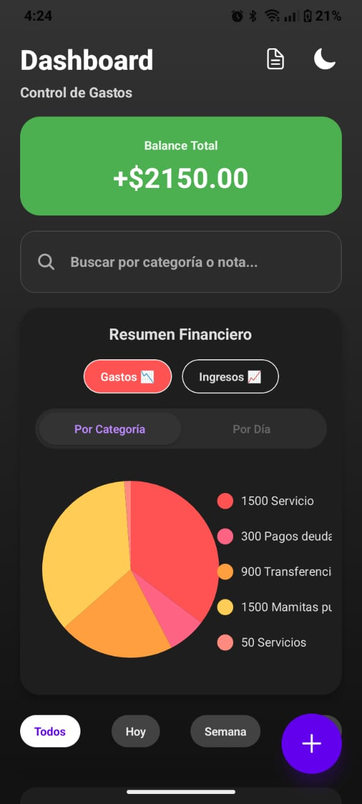
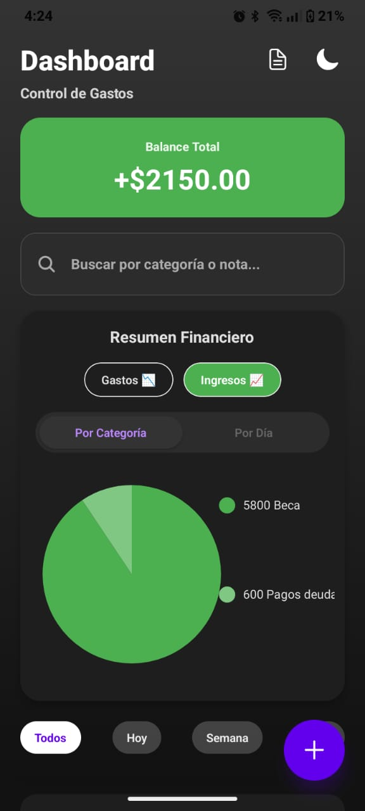
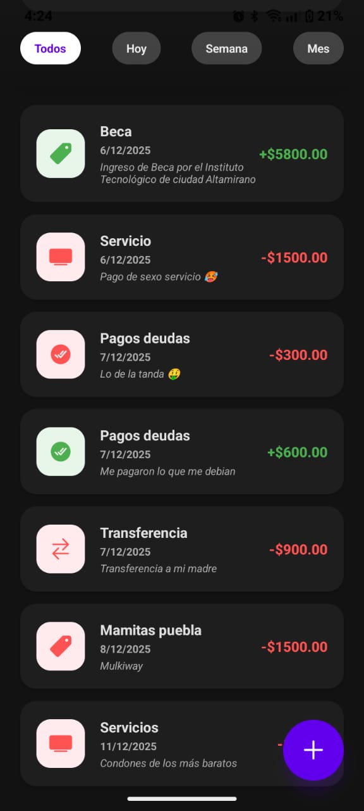
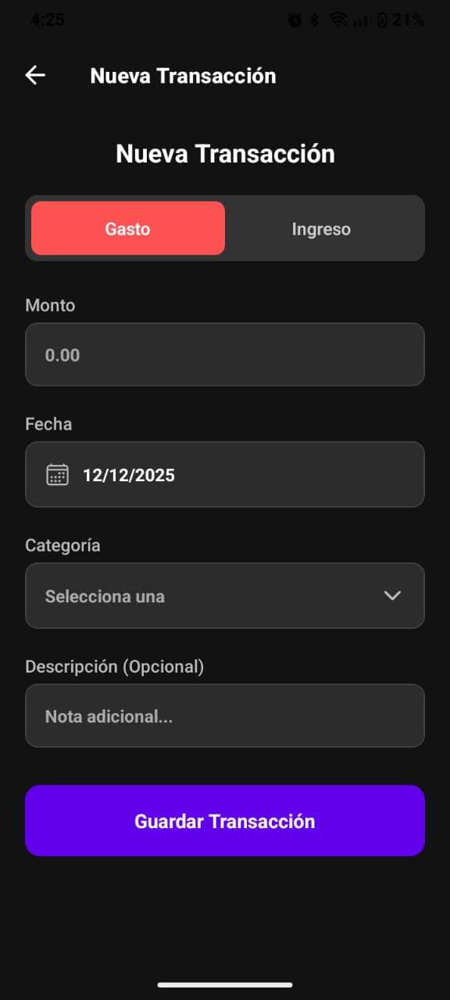

💰 Controlador de Gastos

Aplicación móvil para el control de gastos e ingresos personales desarrollada con React Native y Expo. Permite gestionar transacciones, visualizar estadísticas con gráficos interactivos y generar reportes en PDF.

[📱 Descargar APK](https://expo.dev/accounts/angiedta/projects/ControladorGastos/builds/bef59723-11c9-45c2-b7a5-1028aa26c911)


📱 Sobre el Proyecto

Controlador de Gastos es una aplicación móvil diseñada para ayudarte a tomar control total de tus finanzas personales. Con una interfaz intuitiva y moderna, puedes registrar tus ingresos y gastos, visualizar estadísticas detalladas mediante gráficos interactivos, y generar reportes en PDF para compartir o archivar.

La aplicación funciona completamente offline con almacenamiento local, y opcionalmente puede conectarse a un servidor Firefly III para sincronización en la nube. Ya sea que lleves un presupuesto personal, necesites controlar gastos de viaje, o simplemente quieras entender mejor tus hábitos financieros, esta aplicación te proporciona las herramientas que necesitas.


✨ Características Principales

Gestión de Transacciones Completa
- Agrega, edita y elimina transacciones de manera rápida e intuitiva
- Categorización automática con 8 categorías de gastos y 5 de ingresos
- Búsqueda avanzada por descripción o categoría
- Filtros temporales para analizar períodos específicos (hoy, semana, mes o historial completo)

Visualización Inteligente de Datos
- Gráficos interactivos que muestran tu distribución de gastos por categoría
- Vista temporal que revela tus patrones de gasto diarios
- Balance en tiempo real que actualiza automáticamente con cada transacción
- Indicadores visuales que te alertan cuando gastas más de lo habitual

Experiencia de Usuario Premium
- Tema claro y oscuro que se adapta a tus preferencias y las guarda automáticamente
- Interfaz fluida con animaciones suaves y transiciones naturales
- Generación de reportes PDF con un solo toque para compartir por WhatsApp, email o guardar en la nube
- Funciona completamente offline sin necesidad de conexión a internet

Integración Opcional con Firefly III
- Conecta tu aplicación con un servidor Firefly III personal si deseas sincronización
- Modo demo incluido que funciona sin necesidad de configuración externa
- Migración sencilla de datos locales a servidor cuando lo decidas


📸 Capturas de Pantalla

<div align="center">

Dashboard de Gastos





Visualiza tus gastos organizados por categorías con gráficos de torta interactivos. Identifica rápidamente dónde se va tu dinero y toma decisiones informadas sobre tu presupuesto.


Dashboard de Ingresos





Monitorea tus ingresos a lo largo del tiempo y compara diferentes períodos. Entiende las tendencias de tus entradas de dinero para planificar mejor tu futuro financiero.


Lista de Transacciones





Accede al historial completo de todas tus transacciones con filtros avanzados. Busca movimientos específicos por fecha, categoría o descripción en segundos.


Nueva Transacción





Interfaz intuitiva para registrar nuevas transacciones. El formulario te guía paso a paso para capturar toda la información importante: tipo, monto, categoría, fecha y descripción.

</div>


🚀 Instalación

Para Usuarios (Descargar la App)

La forma más rápida de probar la aplicación es descargar el APK directamente en tu dispositivo Android. Este es un archivo de instalación listo para usar que no requiere ninguna configuración técnica.

Pasos para instalar:

1. Descarga el APK: Abre este enlace desde tu teléfono Android → [Descargar Controlador de Gastos APK](https://expo.dev/accounts/angiedta/projects/ControladorGastos/builds/bef59723-11c9-45c2-b7a5-1028aa26c911)

2. Permite instalación de fuentes desconocidas: Cuando intentes instalar, Android te pedirá permiso. Ve a Configuración → Seguridad → Permitir instalación de aplicaciones desconocidas para tu navegador

3. Instala la aplicación: Toca el archivo APK descargado y sigue las instrucciones en pantalla

4. Abre y disfruta: Encuentra el ícono de Controlador de Gastos en tu lista de aplicaciones y comienza a gestionar tus finanzas

> Nota sobre seguridad: Android muestra una advertencia porque la aplicación no viene de Google Play Store. Esto es completamente normal para aplicaciones que se distribuyen directamente. El código fuente de esta aplicación es público y puedes revisarlo en este repositorio.

Para Desarrolladores (Ejecutar el Código)

Si eres desarrollador y quieres ejecutar el código fuente, modificar la aplicación, o contribuir al proyecto, sigue estos pasos detallados.

Prerrequisitos

Antes de comenzar, asegúrate de tener instalado en tu sistema:
- Node.js versión 20 o superior (puedes verificar tu versión con `node --version`)
- npm versión 11 o superior (puedes verificar tu versión con `npm --version`)
- Expo Go instalado en tu dispositivo móvil (disponible en App Store o Google Play)
- Git para clonar el repositorio

Pasos de instalación

Primero, clona este repositorio en tu computadora. Abre tu terminal y ejecuta:

```bash
git clone https://github.com/angiedtadocuments-cloud/ControladorGastos
cd controlador-gastos
```

Este comando descarga todo el código fuente del proyecto y te posiciona dentro de la carpeta del proyecto. A continuación, instala todas las dependencias necesarias:

```bash
npm install
```

Este paso puede tomar varios minutos dependiendo de tu conexión a internet, ya que npm descargará todas las librerías que la aplicación necesita para funcionar. Una vez completada la instalación, inicia el servidor de desarrollo de Expo:

```bash
npm start
```

Este comando abrirá Expo Developer Tools en tu navegador y mostrará un código QR en tu terminal. Para ver la aplicación en tu dispositivo móvil, abre la aplicación Expo Go y escanea el código QR. Si estás en iOS, usa la cámara nativa del teléfono. Si estás en Android, usa el escáner dentro de la aplicación Expo Go.

Scripts disponibles

El proyecto incluye varios scripts de npm para diferentes propósitos:

```bash
npm start          # Inicia el servidor de desarrollo con opciones interactivas
npm run android    # Abre la aplicación directamente en un emulador Android si tienes uno configurado
npm run ios        # Abre la aplicación en el simulador de iOS si estás en macOS
npm run web        # Abre una versión web de la aplicación en tu navegador
```


🏗️ Arquitectura del Proyecto

La aplicación está estructurada siguiendo las mejores prácticas de React Native y arquitectura de componentes. Aquí está la organización del código:

```
ControladorGastos/
├── src/
│   ├── context/              # Contextos de React para estado global
│   │   ├── AuthContext.tsx       # Manejo de autenticación (si usas Firefly III)
│   │   ├── ThemeContext.tsx      # Control del tema claro/oscuro
│   │   └── TransactionContext.tsx # Estado global de transacciones
│   ├── hooks/                # Custom hooks reutilizables
│   │   ├── useTheme.tsx          # Hook para acceder y cambiar el tema
│   │   └── useTransactions.tsx   # Hook para gestionar transacciones
│   ├── screens/              # Componentes de pantalla
│   │   ├── Auth/                 # Pantallas de autenticación
│   │   └── Dashboard/
│   │       ├── DashboardScreen.tsx        # Pantalla principal con gráficos
│   │       └── AddTransactionScreen.tsx   # Formulario de nueva transacción
│   ├── services/             # Servicios y lógica de negocio
│   │   ├── api.ts                # Cliente HTTP para conexión con Firefly III
│   │   └── storage.ts            # Capa de abstracción para AsyncStorage
│   └── types/                # Definiciones de TypeScript
│       └── index.ts              # Interfaces y tipos globales
├── screenshots/              # Capturas de pantalla para el README
├── App.tsx                   # Punto de entrada de la aplicación
├── eas.json                  # Configuración de EAS Build para generar APKs
└── package.json              # Dependencias y scripts del proyecto
```

Decisiones de arquitectura

El proyecto utiliza Context API de React para el manejo de estado global, lo cual es apropiado para una aplicación de este tamaño sin necesidad de librerías adicionales como Redux. Los custom hooks encapsulan la lógica de negocio y la hacen reutilizable, mientras que la separación entre servicios y componentes mantiene el código limpio y fácil de testear.


📦 Dependencias Principales

La aplicación está construida con tecnologías modernas y confiables. Aquí están las librerías principales que hacen posible cada funcionalidad:

Navegación y UI
- `@react-navigation/native` y `@react-navigation/native-stack`: Manejo de navegación entre pantallas con transiciones nativas y historial de navegación
- `expo-linear-gradient`: Gradientes suaves para mejorar la estética visual
- `@expo/vector-icons`: Biblioteca completa de iconos para una interfaz expresiva

Gestión de Datos
- `@react-native-async-storage/async-storage`: Almacenamiento persistente local que guarda tus datos incluso cuando cierras la aplicación
- `axios`: Cliente HTTP para comunicación con APIs externas como Firefly III

Visualización y Gráficos
- `react-native-chart-kit`: Gráficos de torta y líneas interactivos para visualizar tus finanzas
- `react-native-svg`: Motor de renderizado de gráficos vectoriales

Funcionalidades Avanzadas
- `expo-print` y `expo-sharing`: Generación de PDFs y compartir reportes a través de otras aplicaciones
- `@react-native-community/datetimepicker`: Selector de fechas nativo que se integra con el sistema operativo

Puedes ver la lista completa de dependencias con sus versiones exactas en el archivo `package.json` del proyecto.


🎯 Guía de Uso

Agregar una Nueva Transacción

El flujo de agregar una transacción está diseñado para ser rápido y sin fricciones. Sigue estos pasos:

Primero, desde la pantalla principal, toca el botón flotante con el símbolo de más (+) que se encuentra en la esquina inferior derecha. Este botón está siempre visible sin importar en qué parte de la aplicación te encuentres, facilitando el acceso rápido.

Una vez en la pantalla de nueva transacción, selecciona si deseas registrar un gasto o un ingreso usando los botones en la parte superior. La interfaz cambiará de color sutilmente para indicar el tipo seleccionado: los gastos usan tonos rojos y los ingresos tonos verdes.

A continuación, ingresa el monto de la transacción. El campo numérico está optimizado para que tu teclado numérico se abra automáticamente, facilitando la entrada rápida de datos. Selecciona la fecha usando el calendario integrado; por defecto se sugiere la fecha actual pero puedes cambiarla fácilmente tocando el campo de fecha.

Elige una categoría de la lista predefinida. Las categorías de gastos incluyen opciones como comida, transporte, entretenimiento, servicios, salud, educación, compras y otros. Para ingresos, encontrarás categorías como salario, freelance, inversiones, regalos y otros. Si ninguna categoría se ajusta perfectamente a tu transacción, puedes usar la categoría "Otros" y especificar más detalles en la descripción.

Opcionalmente, agrega una descripción para recordar el contexto de la transacción. Por ejemplo, si registras un gasto de comida, podrías escribir "Almuerzo con cliente" o "Compra semanal del supermercado". Esta información es invaluable cuando revises tus gastos después.

Finalmente, toca el botón "Guardar" y tu transacción se registrará inmediatamente. Verás una animación de confirmación y serás redirigido al dashboard donde podrás ver tu nuevo balance actualizado.

Visualizar y Analizar tus Estadísticas

El dashboard es el corazón de la aplicación, donde toda la información cobra vida a través de visualizaciones claras.

En la parte superior del dashboard encontrarás tu balance total, que muestra la diferencia entre todos tus ingresos y gastos. Este número se actualiza en tiempo real con cada transacción que agregas o eliminas. Un balance positivo se muestra en verde, mientras que un balance negativo aparece en rojo, proporcionando retroalimentación visual instantánea.

Debajo del balance, encontrarás un gráfico de torta que por defecto muestra tus gastos distribuidos por categoría. Este gráfico es interactivo; puedes tocar cualquier segmento para ver el porcentaje exacto y el monto total de esa categoría. Los colores están cuidadosamente elegidos para ser distinguibles incluso para personas con deficiencias en la visión de colores.

Puedes cambiar entre dos vistas del gráfico usando los botones justo encima de él. La vista "Por Categoría" agrupa tus transacciones según su categoría (comida, transporte, etc.), ideal para entender dónde se va tu dinero. La vista "Por Día" agrupa las transacciones por fecha, útil para identificar días donde gastas más de lo habitual.

En la esquina superior derecha del gráfico, encontrarás filtros temporales. Por defecto, el gráfico muestra todas tus transacciones, pero puedes filtrar para ver solo las de hoy, esta semana, o este mes. Estos filtros te ayudan a analizar períodos específicos y entender tendencias temporales en tus finanzas.

Generar y Compartir Reportes

Cuando necesites un registro formal de tus transacciones, la función de exportación a PDF es tu aliada.

Toca el ícono de documento (📄) que se encuentra en la parte superior de la pantalla de dashboard o en la lista de transacciones. La aplicación generará automáticamente un PDF que incluye todas las transacciones que están actualmente visibles según los filtros que hayas aplicado. Esto significa que si estás viendo solo las transacciones de esta semana, el PDF contendrá únicamente esas transacciones.

El PDF generado incluye tu balance total, un resumen por categorías, y una tabla detallada con cada transacción mostrando la fecha, categoría, descripción y monto. El formato está optimizado para ser legible tanto en pantalla como impreso.

Una vez generado el PDF, aparecerá el menú de compartir de tu sistema operativo. Desde aquí puedes enviar el reporte por WhatsApp a tu contador, adjuntarlo a un email para tu jefe, guardarlo en tu Google Drive para respaldo, o imprimirlo directamente si tu impresora está configurada.


🔧 Configuración Avanzada

Conectar con tu Servidor Firefly III

Si tienes tu propia instancia de Firefly III corriendo en un servidor, puedes conectar la aplicación para sincronizar tus datos. Esto te permite acceder a tus finanzas desde múltiples dispositivos y tener un respaldo automático en la nube.

Para configurar la conexión, abre el archivo `src/services/api.ts` en tu editor de código. Busca la línea que define `BASE_URL` y reemplázala con la URL de tu servidor:

```typescript
// Configuración por defecto (modo demo)
const BASE_URL = 'https://demo.firefly-iii.org';

// Cámbiala por tu servidor personal
const BASE_URL = 'https://tu-servidor-firefly.com';
```

También necesitarás configurar tu token de acceso personal de Firefly III. Puedes generar este token desde la configuración de tu cuenta en el panel web de Firefly III. Una vez que tengas el token, agrégalo en el mismo archivo:

```typescript
const API_TOKEN = 'tu_token_personal_aqui';
```

Guarda los cambios y reinicia la aplicación. A partir de este momento, todas las transacciones que crees se sincronizarán automáticamente con tu servidor.

Personalizar Categorías

Las categorías predefinidas cubren la mayoría de casos de uso, pero si tienes necesidades específicas, puedes personalizarlas fácilmente.

Abre el archivo `src/types/index.ts` y busca la constante `CATEGORIES`. Verás dos arrays: uno para gastos (`expense`) y otro para ingresos (`income`). Puedes agregar, eliminar o modificar cualquier categoría según tus necesidades:

```typescript
export const CATEGORIES = {
  expense: [
    'Comida',
    'Transporte', 
    'Entretenimiento',
    'Servicios',
    'Salud',
    'Educación',
    'Compras',
    'Mascotas',        // Categoría nueva que agregaste
    'Viajes',          // Otra categoría personalizada
    'Otros'
  ],
  income: [
    'Salario',
    'Freelance',
    'Inversiones',
    'Regalos',
    'Venta de Artículos',  // Categoría nueva para ingresos
    'Otros'
  ]
};
```

Después de modificar las categorías, reinicia la aplicación para que los cambios tomen efecto. Ten en cuenta que las transacciones anteriores mantendrán sus categorías originales incluso si eliminas esas categorías de la lista.


🤝 Contribuir al Proyecto

Las contribuciones son bienvenidas y apreciadas, ya sea que encuentres un bug, tengas una idea para una nueva funcionalidad, o quieras mejorar la documentación.

Cómo Contribuir

El proceso estándar de contribución usando Git Flow es el siguiente:

Primero, haz un fork de este repositorio usando el botón "Fork" en la esquina superior derecha de GitHub. Esto crea una copia del proyecto en tu cuenta personal donde puedes hacer cambios libremente.

Clona tu fork a tu computadora local:

```bash
git clone https://github.com/angiedtadocuments-cloud/ControladorGastos
cd controlador-gastos
```

Crea una nueva rama para tu funcionalidad o corrección. Es importante usar nombres descriptivos que expliquen qué estás trabajando:

```bash
git checkout -b feature/agregar-grafico-lineas
# o
git checkout -b bugfix/corregir-formato-fecha
```

Realiza tus cambios en el código. Asegúrate de probar exhaustivamente tus modificaciones antes de hacer commit. Si estás agregando una nueva funcionalidad, considera agregar comentarios explicativos en el código.

Cuando estés satisfecho con tus cambios, haz commit con un mensaje claro y descriptivo:

```bash
git add .
git commit -m "Agrega gráfico de líneas para visualizar tendencias temporales"
```

Sube tu rama a tu fork en GitHub:

```bash
git push origin feature/agregar-grafico-lineas
```

Finalmente, ve a la página de tu fork en GitHub y verás un botón para crear un Pull Request. Describe tus cambios detalladamente, explica por qué son útiles, y adjunta capturas de pantalla si los cambios son visuales.

Guías de Estilo

Para mantener la consistencia del código, sigue estas convenciones:

- Usa TypeScript para todos los archivos nuevos, aprovechando el sistema de tipos para prevenir errores
- Nombra componentes usando PascalCase: `MyComponent.tsx`
- Nombra funciones y variables usando camelCase: `handleSubmit`, `userName`
- Agrega comentarios explicativos para lógica compleja, pero evita comentarios obvios que solo repiten lo que el código hace
- Mantén los componentes pequeños y enfocados en una sola responsabilidad
- Usa functional components con hooks en lugar de class components


📝 Licencia

Este proyecto está licenciado bajo la Licencia MIT, lo que significa que eres libre de usar, modificar y distribuir el código tanto para proyectos personales como comerciales. La única condición es que incluyas el aviso de copyright original y la licencia MIT en cualquier copia del software.

Puedes leer el texto completo de la licencia en el archivo `LICENSE` en la raíz del repositorio.


👨‍💻 Autor

Angiedta

Si tienes preguntas, sugerencias, o simplemente quieres conectar, puedes encontrarme en:

- GitHub: [https://github.com/angiedtadocuments-cloud)
- Email: angiedtadocuments@gmail.com


🙏 Agradecimientos

Este proyecto no sería posible sin el increíble trabajo de la comunidad open source. Agradecimientos especiales a:

- El equipo de [Firefly III](https://www.firefly-iii.org/) por crear una API robusta y bien documentada que inspiró este proyecto
- [Expo](https://expo.dev/) por proporcionar herramientas que hacen el desarrollo de aplicaciones móviles accesible para todos
- [React Native Chart Kit](https://github.com/indiespirit/react-native-chart-kit) por los hermosos gráficos que dan vida a los datos financieros
- Todos los contribuidores de las librerías de código abierto que esta aplicación utiliza
